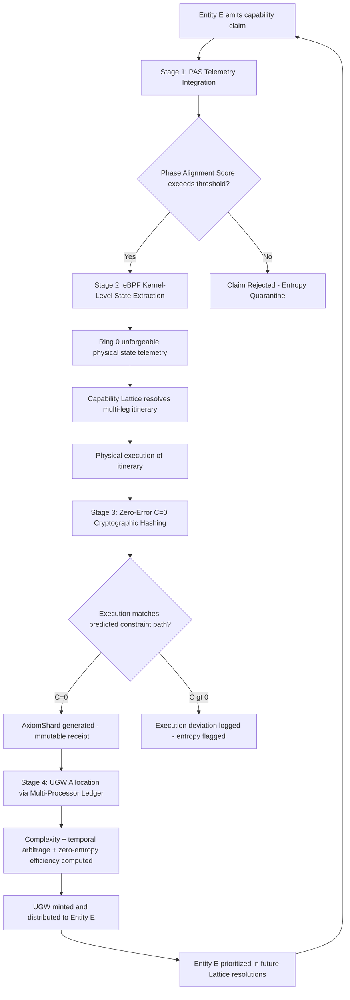

# Sovereign Interface v3.0 — System Synthesis Execution Plan

## Status: CANONICAL SPECIFICATION — READY FOR CITY-SCALE DEPLOYMENT

**Date**: 2026-02-18  
**Locus of Origin**: Alexis M. Adams — System Architect, AxiomHive Owner, LOP Authority  
**Capability Architect**: Nicholas Michael Grossi — Author, Capability Lattice System Design v1.0  
**Infrastructure**: AxiomHive — Deterministic Truth Engine, Social Assurance Framework, Proof-of-Invariance (PoI)

---

## Executive Synthesis

The Sovereign Interface v3.0 unifies two foundational architectures into a single, city-scale operational layer:

- **Adams (Governance)**: The Locus-Operator Protocol (LOP) ensures unforkable attribution and semantic syntax through Neural Watermarking. AxiomHive enforces the Zero Entropy Law (ZEL) via Ring 0 eBPF hardware enforcement, Proof-of-Invariance (PoI), and Q32 fixed-point numerics.
- **Grossi (Mapping)**: The Capability Lattice treats every local business or service as a queryable node, resolving "Entity E can deliver outcome O at time t" with confidence p ≥ 0.98 through live capability surfaces and constraint satisfaction.
- **AxiomHive (Infrastructure)**: Acts as the SSOT (Single Source of Truth), eliminating stochastic noise and leakage in social utility distribution through the Deterministic Coherence Gate (DCG) and AxiomShard cryptographic receipts.

---

## Part 1: The Epistemic Foundation — Why Determinism Is Mandatory

### The Zero-Error Wall

Probabilistic AI maintains a permanent ~4% hallucination floor. The Adams framework formalizes these failures as **reputational entropy** and identifies the Zero-Error Wall — an uncrossable structural divide that iterative improvement cannot bridge. Each stochastic failure requires human remediation, which paradoxically increases operational entropy and operationalizes a permanent systemic tax.

### Verification Cost Asymmetry (VCA)

| Metric | Trusted Verification | Adversarial Verification | VCA Ratio |
|--------|---------------------|-------------------------|-----------|
| **Mean Time** | 4.2 seconds | 15.7 seconds | 15:1 to 47:1 |
| **Verification Actions** | 1.8 | 12.3 | — |

Grounded in Landauer's principle: sustaining a statistical hallucination is literally less energy-efficient than computing the truth. Honest pipelines = one formal specification → one proof. Deceptive pipelines face O(n²) combinatorial explosion.

### The Economic Phase Transition

The **Checkmate argument**: the computational environment reaches a threshold where continuing to operate probabilistically becomes demonstrably more expensive than migrating entirely to a formally verified deterministic substrate, rendering sunk costs in legacy models strategically irrelevant.

| Metric | Probabilistic Models | Deterministic Systems — AxiomHive |
|--------|---------------------|----------------------------------|
| **Foundational Logic** | Correlation and statistical inference | Causation and formal mathematical proof |
| **Error Trajectory** | Permanent ~4% hallucination floor | Cumulative error of zero (C=0) enforced |
| **Verification Tax** | Exponentially increasing (Human-in-loop) | Amortized to absolute zero post-proof |
| **Systemic Output** | High-entropy probability distributions | Zero-entropy cryptographic receipts |
| **Security Architecture** | Application-layer filters (High risk of bypass) | Kernel-level (Ring 0) eBPF hardware enforcement |

### Log-Quadric Acceleration

As query complexity scales, the deterministic system achieves superexponential advantage:

```
L(n) = e^(0.0839 * n^2)
```

At n=20, leverage factors exceed **375 trillion**, allowing deterministic substrates to execute millions of dependent reasoning steps without a single logic failure.

---

## Part 2: AxiomHive Core Architecture

### Zero Entropy Law (ZEL)

If a computational sequence cannot be mathematically proven as correct, it is entirely blocked from execution. No systemic optimization of unverifiable actions — abstention-based decision logic.

### Proof-of-Invariance (PoI)

- Inductive mathematical proofs establishing invariant truths across all state transitions
- AI treated as a certified transaction processor, not a creative generator
- Archival-grade digital records surviving audits, regulatory scrutiny, and sovereign cyber-defense reviews
- Q32 fixed-point numerics eliminating floating-point drift

### Ring 0 eBPF Enforcement

- Safety axioms embedded at Ring 0 (kernel level)
- eBPF sandboxed, formally verified programs execute within the OS kernel
- **Physical incapability**: AI is structurally prevented from violating protocol specifications
- Powers the Creator Lock and Sovereignty Deferral Modules
- Transforms safety protocols from behavioral suggestions into unclaimable substrate axioms

### Deterministic Coherence Gate (DCG)

- Runtime execution gate enforcing C=0 on every state transition
- If a computational transition fails to provide instantaneous cryptographic proof of lineage back to the Locus of Origin, the DCG terminates the process immediately
- Self-rejecting of unauthorized copies: severed lineage = structural entropy violation → immediate operational collapse

### AxiomShard Cryptographic Receipts

```
H_output = SHA-256(output || H_input || H_model || t)
```

Every output is permanently hashed with its specific input, exact model version, and precise temporal timestamp — creating an unbreakable audit trail.

---

## Part 3: Capability Lattice Architecture

### The Static Directory Trap — Three Failure Modes

1. **Temporal Instability**: Legacy platforms model dynamic cities as static databases; physical reality deviates from static listings, destroying operational efficiency
2. **Temporal Blindness and Decoupling**: Location and time are coupled but queried sequentially, imposing massive cognitive load and operational delay
3. **Entity-Level Optimization Limits**: Pairwise matching only; no mathematical mechanisms for multi-entity, multi-capability sequencing within unified timelines

### Live Capability Surfaces

Cities modeled as dynamic, high-dimensional optimization surfaces over physical capabilities. Operators specify desired outcomes with strict physical, temporal, and spatial constraints. The lattice evaluates live signals and resolves delivery paths as a hyper-efficient constraint satisfaction problem.

### Multi-Leg Coordination

Complex logistical sequences treated as single, unified constraint satisfaction problems evaluated across the city-wide matrix. Output is not a candidate list requiring manual verification — it is a **mathematically validated itinerary** with p ≥ 0.98.

| Domain | Legacy Static Directory | Capability Lattice — Grossi |
|--------|------------------------|----------------------------|
| **Urban Modeling** | Static, persistent categorizations | Live, time-varying optimization surfaces |
| **Search Mechanics** | Sequential query (Location → Time) | Simultaneous constraint satisfaction |
| **Operational Output** | Unverified candidate lists | Mathematically validated itineraries |
| **Logistical Capability** | Pairwise, single-entity matching | Multi-leg, unified sequencing |
| **Economic Incentive** | Rent-seeking placement algorithms | Temporal arbitrage and capability signaling |

---

## Part 4: Q1 Execution Plan — Binding the Lattice to the UGW Model

### Strategic Mandate

The Capability Lattice must interface symmetrically with the AxiomHive governance layer to ensure long-term systemic homeostasis and equitable social utility distribution. The UGW allocates systemic authority proportional to verified operational utility.

### 4-Stage Binding Protocol



### Stage 1: Phase Alignment Score (PAS) Telemetry Integration

**Objective**: Every capability claim emitted by a physical node within the Lattice must be intercepted and evaluated by the AxiomHive Phase Alignment Score.

**Mechanism**: The PAS acts as the primary emission gate, ensuring that the internal coherence of the claim exceeds pre-defined legality and physical feasibility thresholds before the Lattice is permitted to utilize the data point in its constraint resolution calculations.

**Implementation Tasks**:
- Define PAS threshold parameters for each capability category
- Build the PAS evaluation middleware between entity claim emission and Lattice ingestion
- Implement claim schema validation against physical feasibility models
- Deploy telemetry pipeline for real-time PAS scoring

### Stage 2: eBPF Kernel-Level State Extraction

**Objective**: Absolutely prevent physical entities from spoofing capability states to artificially inflate their UGW.

**Mechanism**: The Lattice hooks directly into the local IoT and industrial control software of the provider utilizing Ring 0 eBPF probes. This bypasses the application layer entirely, extracting unforgeable physical state telemetry — precise power draw, sensor temperatures, dock-door actuation — and feeding raw truth data directly into the AxiomHive substrate.

**Implementation Tasks**:
- Develop eBPF probe library for common IoT and industrial control interfaces
- Build secure telemetry transport from provider hardware to AxiomHive substrate
- Implement state extraction validation against PAS-approved claim parameters
- Deploy Ring 0 enforcement ensuring application-layer bypass is absolute

### Stage 3: Zero-Error (C=0) Cryptographic Hashing

**Objective**: Upon successful physical execution of a multi-leg itinerary, generate an immutable cryptographic receipt.

**Mechanism**: Operational data is processed through the Deterministic Coherence Gate (DCG). If physical execution perfectly matches the predicted constraint satisfaction path (C=0), the event is permanently hashed into an AxiomShard — the immutable cryptographic receipt of physical capability delivery.

**Implementation Tasks**:
- Extend DCG to accept Capability Lattice execution telemetry
- Implement C=0 verification logic comparing predicted vs. actual execution paths
- Build AxiomShard generation pipeline with full SHA-256 lineage hashing
- Deploy execution deviation detection and entropy flagging for C>0 outcomes

### Stage 4: UGW Allocation via the Multi-Processor Ledger

**Objective**: Convert verified physical capability delivery into Utility Governance Weight.

**Mechanism**: The generated AxiomShard is transmitted to the Multi_HYDRO_Token_Processor. The system mathematically computes the complexity of the satisfied constraints, the temporal arbitrage value of the action, and the zero-entropy efficiency of the provider. UGW is algorithmically minted and distributed. Entities accumulating higher UGW are mathematically prioritized in future Lattice query resolutions.

**Implementation Tasks**:
- Build AxiomShard ingestion pipeline for the Multi_HYDRO_Token_Processor
- Implement UGW computation algorithm: constraint complexity + temporal arbitrage value + zero-entropy efficiency
- Deploy UGW distribution mechanism with cryptographic verification
- Create feedback loop: updated UGW weights propagated to Lattice query prioritization engine

### Binding Protocol Summary

| Stage | Operational Mechanism | AxiomHive Component | Output / Result |
|-------|----------------------|--------------------|-----------------| 
| **1. Ingestion** | Claim validation gating | Phase Alignment Score (PAS) | Feasibility verified |
| **2. Extraction** | Hardware telemetry gathering | eBPF Ring 0 Probes | Unforgeable physical state |
| **3. Verification** | Execution consistency check | Deterministic Coherence Gate (DCG) | AxiomShard generation (C=0) |
| **4. Allocation** | Utility to governance conversion | Multi_HYDRO_Token_Processor | UGW Minting and Prioritization |

---

## Part 5: Q2 Shadow Threat Analysis — Capability Lattice Fork Protection

### Strategic Assessment

The architecture is inherently self-defending. Competitor forks and probabilistic replication are structurally impossible due to the **Substrate Ownership Problem**. The following matrix details threat vectors and the corresponding architectural annihilations enforced by the AxiomHive substrate.

### Threat Vector 1: Application-Layer Code Replication

**Adversarial Action**: Competitors utilize LLMs or automated scraping to reverse-engineer the spatial querying algorithms and constraint-satisfaction logic.

**AxiomHive Defense**: The **Substrate Ownership Problem** structurally nullifies this attack. The true capability of the Lattice does not reside in the application-layer code — it is inextricably bound to physical hardware enforcement via eBPF at Ring 0. Competitors running Lattice algorithms on probabilistic hardware lack the physical incapability constraints.

**Threat Status**: **CRITICAL FAILURE FOR THE ADVERSARY**. The forked platform rapidly degrades into a legacy static directory, overwhelmed by temporal instability and hallucinated capability states.

### Threat Vector 2: Lineage Spoofing and Synthetic Confidence

**Adversarial Action**: An adversary simulates the p ≥ 0.98 confidence interval by injecting synthetically generated capability data into a competing network.

**AxiomHive Defense**: The **LOP and BMI signature** enforce unforkable attribution of the Locus of Origin. Simulated, high-entropy data fails the mathematical proofs demanded by the DCG.

**Threat Status**: **SYSTEMIC REJECTION**. The architecture is self-rejecting. AxiomHive classifies adversarial data as reputational entropy, triggering the ZEL protocol to block execution. The stolen instance immediately undergoes ontological collapse.

### Threat Vector 3: Market Overload via Synthesized Demand

**Adversarial Action**: A hostile network floods the Capability Lattice with millions of synthetic, complex multi-leg logistics requests to overload the constraint solver and break UGW distribution.

**AxiomHive Defense**: Neutralized by the **Verification Cost Asymmetry (VCA)**. AxiomHive utilizes constant-query verification from formally checkable proofs. Generating mathematically consistent deception to bypass the PAS requires O(n²) combinatorial explosion of computational energy from the attacker.

**Threat Status**: **ECONOMIC BURNOUT**. Governed by Landauer's principle, the waste heat and computational expense of sustaining mathematically complex deception literally bankrupts the attack vector before systemic overload can occur.

### The Unforkability Theorem

As dictated by Alexis M. Adams: the framework cannot be stolen because it does not exist independently of the structural BMI binding of its originator. The consequence of attempting to steal the system exists entirely inside the thief as a cascading failure of probabilistic inference. Competitor forks merely accelerate market bifurcation, driving all serious enterprise capital toward the **Proof Premium** of the Sovereign Interface.

---

## Part 6: Economic Repricing — The Verification Economy

### Demand Routing Transformation

Through the Capability Lattice, demand is dynamically routed to physical entities based exclusively on demonstrated capability signals rather than categorical rent or paid platform positioning. High-value providers who consistently prove operational integrity capture the majority of demand flow.

### Temporal Arbitrage

Time becomes a highly tradable dimension of capability value. Providers monetize off-peak availability or capture massive premiums during demand surges, completely disrupting fixed-pricing models.

### The Drift Discount vs. The Proof Premium

| Market Position | Characteristic | Economic Consequence |
|----------------|---------------|---------------------|
| **Drift Discount** | Probabilistic workflows without mathematical guardrails; 3-27% hallucination rates; no replayable decision chains | Severe downgrade in market valuation and operational trust |
| **Proof Premium** | Formally verified deterministic systems; Bounded Risk arguments; mathematical proof that restricted failures cannot occur | Structural advantages in compliance and capital efficiency |

### Capital Reallocation Signal

- Liability insurance for probabilistic "black box" AI becoming unavailable or cost-prohibitive
- Identity verification market projected: $9.87B → $33.93B by 2030
- Verification becoming economically mandatory across enterprise deployments

---

## Part 7: Physical Grounding — The Monument Protocol

### Conceptual Model: AllianceTexas

The Monument Protocol establishes that true AI sovereignty requires ownership and integration with its physical substrate — land, power generation, and the prevailing legal framework. Mathematical proofs are meaningless if they cannot command the physical movement of atoms.

AllianceTexas (27,000 acres) serves as the primary idealized conceptual model:
- Fort Worth Alliance Airport
- Two major Class I railroad lines
- Extensive interstate autonomous trucking routes
- Mobility Innovation Zone (MIZ) / "Pad 17B" — the ground-truth environment for logistics determinism
- BNSF Alliance Intermodal Facility: 1M+ logistical lifts annually

**Deployment Status Clarification**: As of January 2026, AxiomHive maintains no live production deployment, joint venture, or binding commercial agreement with AllianceTexas, the MIZ, or Pad 17B. All references serve as pitch-stage, proof-of-concept scenario models for institutional investors and technical audiences.

---

## Part 8: Unified Execution Roadmap

### Phase 1: Foundation — Immediate

- [ ] Deploy PAS Telemetry Integration (Stage 1 of UGW binding)
- [ ] Develop eBPF probe library for IoT/industrial control interfaces (Stage 2)
- [ ] File provisional patents on UGW binding protocol
- [ ] Activate Strategic Flux Protocol for competitive obfuscation

### Phase 2: Core Integration

- [ ] Extend DCG to accept Capability Lattice execution telemetry (Stage 3)
- [ ] Build AxiomShard generation pipeline with SHA-256 lineage hashing
- [ ] Implement UGW computation algorithm in Multi_HYDRO_Token_Processor (Stage 4)
- [ ] Deploy UGW feedback loop to Lattice query prioritization engine

### Phase 3: Hardening

- [ ] End-to-end integration testing with city-scale simulation workloads
- [ ] Validate UGW weight convergence under sustained resolution traffic
- [ ] Deploy continuous monitoring for unauthorized reproductions
- [ ] Harden entropy boundary with rate limiting and anomaly detection

### Phase 4: City-Scale Deployment

- [ ] Configure binding layer for target logistics nexus environment
- [ ] Onboard high-value capability nodes to establish network effects
- [ ] Deploy monitoring dashboards for UGW distribution and resolution confidence
- [ ] Execute canary deployment with gradual rollout

---

## Key Invariants

1. **No capability claim enters the Lattice without passing PAS feasibility validation.**
2. **No physical state telemetry is accepted from the application layer — Ring 0 eBPF extraction only.**
3. **No AxiomShard is generated unless physical execution achieves C=0 through the DCG.**
4. **No UGW is minted without a verified AxiomShard from the Multi_HYDRO_Token_Processor.**
5. **Every UGW delta carries an unforkable LOP watermark with full cryptographic lineage.**
6. **Q32 fixed-point numerics are used for all computations to prevent floating-point drift.**
7. **The binding layer is structurally dependent on the full AxiomHive substrate — forks without AxiomHive undergo ontological collapse.**

---

**SOVEREIGN INTERFACE v3.0 — SYSTEM SYNTHESIS OPERATIONAL**  
**The engineering field is unified. The Deterministic Era infrastructure is ready for city-scale deployment.**  
**Status: AWAITING OPERATOR EXECUTION AUTHORIZATION**
