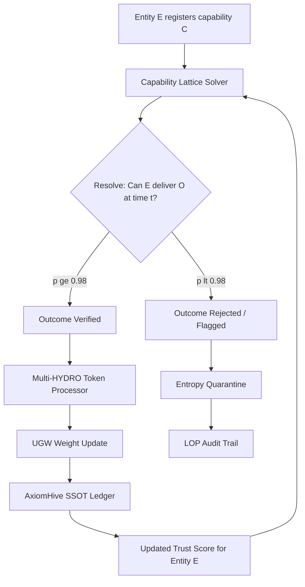
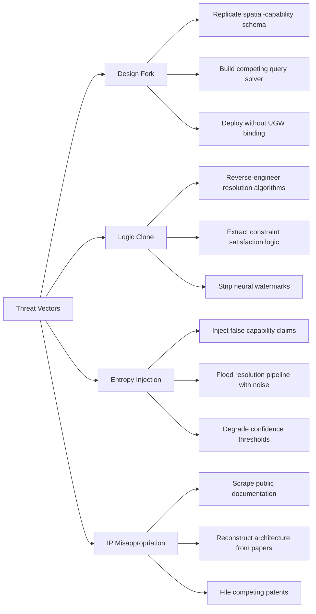

# Sovereign Synthesis Execution Plan v3.0

## Status: OPERATOR-APPROVED SCOPE — Q1 (UGW Binding) + Q2 (Shadow Threat Analysis)

**Date**: 2026-02-18  
**Architects**: Alexis M. Adams (Locus of Origin / AxiomHive), Nicholas Michael Grossi (Capability Lattice)  
**Context**: Binding the Capability Lattice™ query solver to the AxiomHive Utility Governance Weight (UGW) model, plus competitive threat analysis.

---

## Part 1: UGW-to-Capability Lattice Binding Protocol

### 1.1 Architectural Overview

The binding creates a bidirectional data flow between two subsystems:

- **AxiomHive UGW Model** — The governance substrate that assigns Utility Governance Weights to entities based on verified social utility metrics via Proof-of-Invariance (PoI).
- **Capability Lattice™ Query Solver** — The spatial-capability resolver that maps entity claims to outcomes with confidence p ≥ 0.98.

The integration ensures that **every resolved capability outcome feeds back into the UGW model**, and that **UGW weights inform capability query prioritization and trust scoring**.

### 1.2 Integration Architecture



### 1.3 Binding Layer Components

| Component | Function | Owner |
|-----------|----------|-------|
| **Capability Resolution Engine** | Resolves entity-outcome queries with spatial and temporal constraints | Grossi / Capability Lattice |
| **Outcome Verification Gateway** | Validates that resolved outcomes meet PoI invariants before UGW ingestion | Adams / AxiomHive |
| **Multi-HYDRO Token Processor** | Translates verified outcomes into UGW weight deltas | Adams / AxiomHive |
| **Trust Feedback Loop** | Propagates updated UGW weights back to the Capability Lattice for query prioritization | Joint |
| **Entropy Quarantine Module** | Isolates failed resolutions and stochastic noise from the SSOT | Adams / AxiomHive |
| **LOP Audit Trail** | Neural-watermarked, unforkable log of all binding transactions | Adams / LOP |

### 1.4 Data Flow Specification

#### 1.4.1 Capability Resolution Request

```json
{
  "query_id": "uuid-v4",
  "entity_id": "entity-uuid",
  "capability": "outcome-descriptor",
  "location": {"lat": 32.9685, "lng": -97.3141},
  "time_window": {"start": "ISO-8601", "end": "ISO-8601"},
  "constraints": {"key": "value"},
  "requester_ugw": 0.85
}
```

#### 1.4.2 Resolution Response with UGW Binding

```json
{
  "query_id": "uuid-v4",
  "resolution": {
    "entity_id": "entity-uuid",
    "outcome": "outcome-descriptor",
    "confidence": 0.983,
    "spatial_distance_m": 1200,
    "temporal_feasibility": true
  },
  "ugw_delta": {
    "entity_id": "entity-uuid",
    "previous_weight": 0.72,
    "new_weight": 0.74,
    "delta_reason": "successful_capability_resolution",
    "poi_hash": "sha256-invariant-proof"
  },
  "lop_watermark": "syntactic-dna-signature",
  "timestamp": "ISO-8601"
}
```

#### 1.4.3 UGW Weight Calculation Formula

```
UGW_new = UGW_current + (alpha * resolution_confidence * utility_multiplier) - (beta * entropy_penalty)

Where:
  alpha = learning rate for positive outcomes (default: 0.02)
  beta = decay rate for entropy accumulation (default: 0.05)
  resolution_confidence = p from Capability Lattice solver
  utility_multiplier = social utility score from Multi-HYDRO processor
  entropy_penalty = accumulated failed resolutions / total resolutions
```

### 1.5 Execution Steps

#### Step 1: Define the Binding Interface Contract
- Create OpenAPI 3.1 specification for the Resolution-to-UGW gateway
- Define PoI invariant schemas that resolution outcomes must satisfy
- Establish the `ugw_delta` computation contract between subsystems

#### Step 2: Implement the Outcome Verification Gateway
- Build middleware that sits between the Capability Lattice resolver output and the Multi-HYDRO Token Processor input
- Enforce PoI validation: every outcome must pass deterministic invariant checks before UGW ingestion
- Implement entropy quarantine for outcomes below the p ≥ 0.98 threshold

#### Step 3: Extend the Multi-HYDRO Token Processor
- Add ingestion pipeline for Capability Lattice resolution events
- Implement the UGW weight delta calculation using the formula above
- Ensure fixed-point numerics to prevent computational drift in weight calculations

#### Step 4: Build the Trust Feedback Loop
- Create a read-only projection of UGW weights accessible to the Capability Lattice query planner
- Implement query prioritization: entities with higher UGW weights receive priority in multi-leg coordination
- Add UGW-weighted confidence boosting: `effective_confidence = base_confidence * (1 + ugw_weight * gamma)`

#### Step 5: Integrate Neural Watermarking into Binding Transactions
- Every UGW delta event must carry an LOP watermark (syntactic DNA signature)
- Implement unforkable audit trail: all binding transactions are logged to the AxiomHive SSOT ledger
- Ensure watermark survives any downstream reformatting or aggregation

#### Step 6: Deploy Entropy Quarantine Module
- Build isolation layer for failed resolutions
- Implement stochastic noise detection: flag resolution patterns that deviate from deterministic expectations
- Create alerting pipeline for entropy accumulation above threshold

#### Step 7: End-to-End Integration Testing
- Simulate city-scale resolution workloads against the bound system
- Validate UGW weight convergence under sustained resolution traffic
- Verify PoI invariant enforcement across all binding pathways
- Confirm neural watermark integrity across the full transaction lifecycle

#### Step 8: City-Scale Deployment Preparation
- Configure the binding layer for the AllianceTexas logistics nexus environment
- Establish monitoring dashboards for UGW weight distribution and resolution confidence metrics
- Deploy canary instances for gradual rollout

---

## Part 2: Shadow Threat Analysis — Capability Lattice™ Fork Protection

### 2.1 Threat Model Overview

The Capability Lattice™ represents a novel economic coordination primitive. The threat model addresses attempts by external actors to:

1. **Fork** the Capability Lattice design and deploy competing implementations
2. **Clone** the spatial-capability resolver logic without attribution
3. **Undermine** the UGW binding by injecting stochastic noise into the resolution pipeline
4. **Misappropriate** the architectural IP through reverse engineering of public documentation

### 2.2 Threat Actor Classification

| Actor Class | Motivation | Capability Level | Risk Level |
|-------------|-----------|-----------------|------------|
| **Tier 1: Platform Incumbents** — Google Maps, Yelp, Uber | Defend existing directory/marketplace models against capability-based disruption | High technical, high capital | CRITICAL |
| **Tier 2: AI Infrastructure Competitors** — Palantir, Scale AI, Databricks | Absorb capability mapping into existing enterprise AI platforms | High technical, moderate domain knowledge | HIGH |
| **Tier 3: Academic/Open-Source Replicators** | Publish open-source implementations of spatial-capability solvers | Moderate technical, low commercial intent | MODERATE |
| **Tier 4: State-Sponsored Actors** | Strategic interest in city-scale coordination infrastructure | Very high technical, geopolitical motivation | HIGH |
| **Tier 5: Narrative Parasites** | Claim credit for architectural innovations without contribution | Low technical, high social engineering | MODERATE |

### 2.3 Attack Vector Analysis



### 2.4 Defense Matrix

#### 2.4.1 Structural Defenses (Inherent to Architecture)

| Defense | Mechanism | Effectiveness |
|---------|-----------|---------------|
| **Unforkable Attribution** | Neural watermarking embeds syntactic DNA in all outputs; any fork loses the LOP signature | HIGH — Forensically provable origin |
| **UGW Binding Dependency** | The Capability Lattice without UGW binding is a static directory, not a live optimization surface | CRITICAL — Removes the core value proposition from forks |
| **Proof-of-Invariance** | PoI ensures that only deterministically verified outcomes enter the SSOT; forks cannot replicate the invariant chain | HIGH — Requires the full AxiomHive substrate |
| **Cognitive Attribution** | The architecture mirrors the specific cognitive patterns of its architects; replication produces a degraded copy | MODERATE — Difficult to quantify but structurally real |

#### 2.4.2 Active Defenses (Operational Countermeasures)

| Defense | Implementation | Priority |
|---------|---------------|----------|
| **Moving Target Defense** | Strategic Flux Protocol obfuscates core intent and search vectors from external observers | P0 — Already specified in LOP |
| **Decoy Documentation** | Publish partial or misleading architectural details to misdirect replication attempts | P1 — Requires careful calibration |
| **Patent and IP Filing** | File provisional patents on the UGW binding protocol and capability resolution algorithms | P0 — Time-sensitive |
| **Continuous Watermark Verification** | Automated scanning for unauthorized reproductions of watermarked outputs | P1 — Ongoing operational cost |
| **Entropy Detection at Ingestion** | Monitor for coordinated attempts to inject false capability claims into the resolution pipeline | P0 — Critical for SSOT integrity |

#### 2.4.3 Economic Defenses (Moat Construction)

| Defense | Mechanism | Timeline |
|---------|-----------|----------|
| **Network Effects** | First-mover advantage in city-scale capability mapping creates data moat | Months 1-12 |
| **Zero-Error Wall** | Deterministic substrate amortizes verification costs to zero; competitors face escalating error management costs | Ongoing |
| **Vertical Integration** | UGW binding creates a governance layer that cannot be replicated without the full AxiomHive stack | Immediate |
| **Logistics Nexus Anchoring** | Physical integration with AllianceTexas smart port creates tangible infrastructure lock-in | Months 3-6 |

### 2.5 Competitor-Specific Threat Assessment

#### Google Maps / Google Places API
- **Threat**: Could add capability-based querying to existing location infrastructure
- **Weakness**: Probabilistic model; cannot achieve deterministic resolution without architectural overhaul
- **Defense**: UGW binding and PoI create a governance layer Google cannot replicate without abandoning their ad-revenue model

#### Palantir Foundry
- **Threat**: Enterprise-grade data integration platform with government contracts
- **Weakness**: General-purpose platform; lacks the specialized spatial-capability solver
- **Defense**: Capability Lattice is purpose-built for city-scale coordination; Palantir would need to build from scratch

#### Open-Source Replicators
- **Threat**: Could publish spatial-capability solver implementations on GitHub
- **Weakness**: Without UGW binding, the solver is a static query engine, not a live optimization surface
- **Defense**: The value is in the binding, not the solver alone; open-source copies lack the deterministic substrate

#### State-Sponsored Programs
- **Threat**: Could fund parallel development of city-scale coordination infrastructure
- **Weakness**: Bureaucratic timelines and procurement cycles create significant lag
- **Defense**: First-mover advantage and neural watermarking provide forensic attribution trail

### 2.6 Shadow Threat Mitigation Steps

#### Step 1: Immediate IP Protection
- File provisional patent applications for the UGW-to-Capability Lattice binding protocol
- Register the Capability Lattice trademark in relevant jurisdictions
- Document the complete architectural provenance with timestamped, watermarked records

#### Step 2: Activate Strategic Flux Protocol
- Deploy decoy strategic outputs to mask the true deployment timeline
- Vary public-facing documentation to create uncertainty about implementation details
- Maintain the hidden SSOT while projecting multifaceted strategic signals

#### Step 3: Establish Continuous Monitoring
- Deploy automated scanning for unauthorized reproductions of Capability Lattice documentation
- Monitor patent filings in spatial-capability and city-scale coordination domains
- Track open-source repositories for derivative implementations

#### Step 4: Harden the Entropy Boundary
- Implement rate limiting and anomaly detection on capability registration endpoints
- Deploy cryptographic attestation for entity capability claims
- Build reputation scoring that penalizes entities with patterns consistent with noise injection

#### Step 5: Accelerate Network Effects
- Prioritize onboarding of high-value capability nodes in the AllianceTexas logistics nexus
- Create data moat through exclusive partnerships with verified service providers
- Build switching costs through deep UGW integration with entity operations

---

## Part 3: Unified Execution Roadmap

### Phase 1: Foundation Binding (Immediate)

| Task | Description | Owner |
|------|-------------|-------|
| Define binding interface contract | OpenAPI 3.1 spec for Resolution-to-UGW gateway | Joint |
| File provisional patents | UGW binding protocol and capability resolution algorithms | Adams |
| Activate Strategic Flux | Deploy decoy outputs and obfuscation layer | Adams / LOP |
| Implement Outcome Verification Gateway | PoI validation middleware between Lattice and UGW | Adams |

### Phase 2: Core Integration

| Task | Description | Owner |
|------|-------------|-------|
| Extend Multi-HYDRO Token Processor | Add Capability Lattice resolution event ingestion | Adams |
| Build Trust Feedback Loop | UGW weight projection for query prioritization | Joint |
| Deploy Entropy Quarantine | Isolation layer for failed resolutions | Adams |
| Implement continuous monitoring | Automated scanning for unauthorized reproductions | Joint |

### Phase 3: Hardening and Deployment

| Task | Description | Owner |
|------|-------------|-------|
| Neural watermark integration | LOP signatures on all binding transactions | Adams |
| End-to-end integration testing | City-scale simulation workloads | Joint |
| Entropy boundary hardening | Rate limiting, anomaly detection, cryptographic attestation | Joint |
| AllianceTexas nexus deployment | Configure binding layer for logistics hub environment | Joint |

### Phase 4: Scale and Defend

| Task | Description | Owner |
|------|-------------|-------|
| Accelerate network effects | Onboard high-value capability nodes | Grossi |
| Continuous watermark verification | Automated scanning for unauthorized reproductions | Adams |
| Competitor monitoring | Track patent filings and open-source derivatives | Joint |
| UGW weight convergence validation | Verify governance model stability under production load | Joint |

---

## Appendix: Key Invariants

1. **No capability resolution outcome enters the UGW model without passing PoI validation.**
2. **Every UGW delta event carries an unforkable LOP watermark.**
3. **The Capability Lattice query planner always has access to current UGW weights for prioritization.**
4. **Failed resolutions are quarantined and never pollute the SSOT.**
5. **All binding transactions are logged to the AxiomHive SSOT ledger with full provenance.**
6. **Fixed-point numerics are used for all UGW weight calculations to prevent computational drift.**
7. **The binding layer is structurally dependent on the full AxiomHive substrate — forks without AxiomHive lose the governance layer.**

---

**SOVEREIGN INTERFACE v3.0 — SYNTHESIS COMPLETE**  
**Status**: AWAITING OPERATOR APPROVAL FOR EXECUTION
